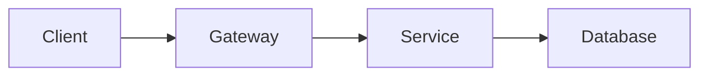

# Portfolio site guide

This guide covers the one-time setup, then everything you need to keep adding content.

## 1. How the site works

```
Markdown files ──push──▶ GitHub Actions ──▶ content check ──▶ Jekyll + Just the Docs ──▶ GitHub Pages
```

- **You write Markdown.** Each project is one `.md` file in `projects/`. Front matter (the block between `---` lines) controls the page title, sidebar position and draft status.
- **Jekyll** turns the Markdown into HTML. **Just the Docs** is the theme. It provides the dark colour scheme, the sidebar navigation (built automatically from front matter), full-text search and Mermaid diagrams.
- **GitHub Actions** (`.github/workflows/pages.yml`) builds and deploys the site on every push to `main`. You never run a build by hand.
- **The content check** (`scripts/check-content.sh`) runs before the build and fails the deployment if:
  - `_config.yml` still contains `YOUR-USERNAME`, or
  - a page that would be published still contains a `[TODO` placeholder.

  Unfinished pages stay safely hidden as drafts.

Versions are pinned: the theme and Jekyll versions in `Gemfile` and every transitive dependency in `Gemfile.lock`, so the same content always builds the same way.

### Repository layout

```
.
├── .github/workflows/pages.yml   # build + deploy pipeline
├── _config.yml                   # site settings (title, theme, dark mode, Mermaid)
├── _includes/mermaid_config.js   # Mermaid diagram theme (dark)
├── _templates/project.md         # copy this to start a new project page
├── assets/images/                # images, one folder per project
├── projects/
│   ├── index.md                  # "Projects" section page (lists children automatically)
│   └── *.md                      # one file per project
├── scripts/check-content.sh      # pre-build placeholder guard
├── index.md                      # home page
├── Gemfile / Gemfile.lock        # pinned Ruby dependencies
└── GUIDE.md / README.md          # docs for you; excluded from the site
```

## 2. One-time setup

### 2.1 Create the repository

1. On GitHub, create a new **public** repository named exactly `<your-username>.github.io`. For example, if your username is `crow-dev`, the repository must be `crow-dev.github.io`.
2. Do not initialise it with a README, since you are pushing existing files.

### 2.2 Set your username

In `_config.yml`, replace `YOUR-USERNAME` in both places:

```yaml
url: https://crow-dev.github.io
...
aux_links:
  GitHub: https://github.com/crow-dev
```

### 2.3 Push the files

From the folder containing these files:

```bash
git init
git add .
git commit -m "Initial portfolio site"
git branch -M main
git remote add origin https://github.com/<your-username>/<your-username>.github.io.git
git push -u origin main
```

### 2.4 Switch Pages to GitHub Actions

In the repository, go to **Settings → Pages → Build and deployment → Source** and select **GitHub Actions**.

This step matters. The default source ("Deploy from a branch") uses GitHub's built-in Jekyll, which ignores your pinned `Gemfile` and the content check.

### 2.5 Verify the deployment

1. Open the **Actions** tab and watch the "Deploy site to GitHub Pages" run. If it ran before you changed the source in step 2.4, click **Re-run all jobs**.
2. When both jobs are green, open `https://<your-username>.github.io`.

At this point all four project pages are drafts, so the live site shows the Home page and an empty Projects section. Section 3 explains how to publish them.

## 3. Finishing and publishing a draft page

Each page in `projects/` is pre-written from what is known about the project. The gaps are marked `[TODO: ...]`, and each TODO tells you what to write.

1. Open the page, for example `projects/sdven-security.md`.
2. Replace every `[TODO: ...]`. Fill in facts only: never leave a claim you cannot defend in an interview.
3. Delete the `published: false ...` line from the front matter.
4. Run the check locally if you can (`bash scripts/check-content.sh`), then commit and push.

If a TODO slips through, the Actions run fails with an annotation naming the file and line. Nothing broken gets deployed.

## 4. Adding a new project

### 4.1 Create the page

```bash
cp _templates/project.md projects/nbody-simulation.md
```

The file name becomes the URL: `projects/nbody-simulation.md` is served at `/projects/nbody-simulation/`. Use short, lowercase, hyphenated names and don't rename files after sharing links.

### 4.2 Front matter reference

```yaml
---
title: Parallel N-Body Simulation   # sidebar label and page title
parent: Projects                    # must match the Projects page title exactly
nav_order: 5                        # sidebar position; lower numbers first
description: One sentence, under 160 characters, used for search results and link previews.
published: false                    # draft; delete this line to publish
---
```

To reorder projects, change `nav_order` values. Give every page a unique number: pages with equal values have an unstable order.

### 4.3 Recommended page structure

The template follows this structure. Keep it consistent across projects so readers know where to look.

| Section | What goes in it |
|---|---|
| Summary + table | One paragraph and the at-a-glance table (type, role, stack, period, source) |
| Problem | What needed solving, the constraints, and why it was hard |
| Architecture | A diagram and one short paragraph per component |
| Key decisions | Two or three decisions: options considered, choice, trade-off accepted |
| Results | Numbers wherever possible (latency, throughput, accuracy, coverage) |
| What I'd change | Honest lessons; interviewers value this section highly |

Aim for something a reviewer can read in about five minutes, and link to the repository for depth.

## 5. Content building blocks

### 5.1 Images

Put images in a per-project folder, for example `assets/images/nbody/`, and embed them with `relative_url` so paths keep working if the site ever moves:

```markdown

```

- Export screenshots and charts as **WebP** or optimised **PNG**, ideally 100–300 KB each and about 1600 px wide at most.
- Always write descriptive alt text; it is read by screen readers and search engines.
- Do not commit videos. Upload them to YouTube (unlisted is fine) and link them. Large binaries bloat Git history permanently.

### 5.2 Diagrams (Mermaid)

Fenced code blocks tagged `mermaid` render as diagrams, already themed dark:

````markdown

````

Draft and preview diagrams at [mermaid.live](https://mermaid.live) before pasting them in. Flowcharts and sequence diagrams cover most architecture explanations.

### 5.3 Callouts

Two callout styles are configured in `_config.yml`. Put the class on the line directly above a paragraph:

```markdown
{: .note }
The simulation results below use the 200-vehicle scenario.

{: .warning }
This service is a prototype and was never load-tested.
```

To add a new style (such as `tip`), add it under `callouts:` in `_config.yml` with a `title` and a `color` (for example `green`, `purple` or `yellow`).

### 5.4 Code blocks

Always tag the language so syntax highlighting works:

````markdown
```go
func Sign(claims Claims, key ed25519.PrivateKey) (string, error) { ... }
```
````

Show short, representative excerpts, not whole files. Link to the repository for the rest.

### 5.5 Links between pages

Use Jekyll's `link` tag instead of hard-coded URLs:

```markdown
See the [authentication server]() for how tokens are issued.
```

The build **fails** if the target file does not exist, so broken internal links are caught before deployment. The same applies when the target is still a draft: link to a page only after it is published.

## 6. Growing the site

### 6.1 Add your CV

Place the PDF at `assets/cv.pdf` and link it from `index.md`:

```markdown
[Download CV]({{ '/assets/cv.pdf' | relative_url }}){: .btn .fs-5 .mb-4 .mb-md-0 }
```

### 6.2 Add a new section (e.g. technical notes)

Sections are just parent pages. Create `notes/index.md`:

```yaml
---
title: Notes
nav_order: 3
permalink: /notes/
---
```

Then give each note `parent: Notes`. The sidebar entry and the list of child pages are generated automatically.

### 6.3 Add more top-right links

Add entries under `aux_links` in `_config.yml`:

```yaml
aux_links:
  GitHub: https://github.com/<your-username>
  LinkedIn: https://www.linkedin.com/in/<your-handle>
```

## 7. Local preview (optional)

You don't need this, since every push builds in CI. It's useful for checking layout before pushing. The easiest route on Windows is WSL (Ubuntu):

```bash
sudo apt install ruby-full build-essential zlib1g-dev
gem install bundler
bundle config set --local path vendor/bundle   # keep gems inside the project
bundle install
bundle exec jekyll serve --unpublished --livereload
```

Open `http://localhost:4000`. The `--unpublished` flag shows draft pages locally so you can preview them before removing `published: false`.

## 8. Custom domain (optional)

To serve the site from a subdomain such as `projects.maleeshafonseka.com`, which leaves the root domain free for your main site:

1. At your DNS provider, add a **CNAME** record: `projects` → `<your-username>.github.io`.
2. In **Settings → Pages → Custom domain**, enter `projects.maleeshafonseka.com` and save. When the DNS check passes, tick **Enforce HTTPS**.
3. Update `url:` in `_config.yml` to `https://projects.maleeshafonseka.com`.

A `CNAME` file in the repository is not needed when deploying with GitHub Actions; the setting in step 2 is what counts.

## 9. Upgrading the theme

1. Check the [Just the Docs releases](https://github.com/just-the-docs/just-the-docs/releases) and read the migration guide for anything marked "potentially breaking".
2. Change the version in `Gemfile`, then regenerate the lockfile locally (this needs the Ruby setup from section 7):

   ```bash
   bundle update just-the-docs
   ```

3. Preview locally, then commit `Gemfile` and `Gemfile.lock` together.

The same applies to Mermaid: change `mermaid.version` in `_config.yml`, then check that your diagrams still render.

## 10. Troubleshooting

| Symptom | Cause and fix |
|---|---|
| Actions run fails at **Check content** | The annotation names the file and line. Resolve the `[TODO`, replace `YOUR-USERNAME`, or keep the page as a draft. |
| Build fails with "Could not find document" | A `` points to a missing, renamed or draft page. Fix the path or wait until the target is published. |
| Build fails at **bundle install** | `Gemfile` and `Gemfile.lock` disagree. Regenerate the lock with `bundle install` locally and commit both files. |
| Site shows 404 after a green run | Pages source is not set to **GitHub Actions** (step 2.4), or the CDN is still propagating; wait a few minutes. |
| Page missing from the sidebar | Page is still `published: false`, or `parent:` doesn't exactly match the parent page's `title`. |
| Diagram shows as plain code | The fence must be exactly ```` ```mermaid ````, and the diagram syntax must be valid (check it on mermaid.live). |

## 11. Limits worth knowing

The published site can be up to 1 GB, with a soft bandwidth limit of 100 GB per month. Text is negligible; images are the only thing that will ever add up. Compress them and keep videos off the repository, and you won't need to think about limits.
