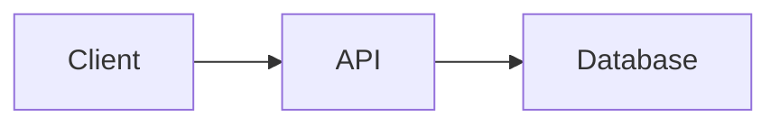

---
# Copy this file to projects/<short-name>.md, then fill in every [TODO].
# Keep `published: false` until the page is finished; CI blocks publishing
# a page that still contains a [TODO] placeholder.
title: "[TODO: Project name]"
parent: Projects
nav_order: 99 # lower numbers appear first in the sidebar
description: "[TODO: One sentence, under 160 characters, shown in search results]"
published: false
---

# [TODO: Project name]
{: .no_toc }

[TODO: One-paragraph summary: what it is, who it is for, and the single most impressive thing about it.]
{: .fs-5 .fw-300 }

| | |
|---|---|
| **Type** | [TODO: Personal / coursework / group / industry] |
| **My role** | [TODO: What you personally owned] |
| **Stack** | [TODO: Languages, frameworks, infrastructure] |
| **Period** | [TODO: Month Year – Month Year] |
| **Source** | [TODO: Repository link, or "Private"] |

  
Contents

  {: .text-delta }
- TOC
{:toc}

## Problem

[TODO: The problem, the constraints, and why it was non-trivial.]

## Architecture

[TODO: Replace the diagram below with your system.]

## Key decisions

### [TODO: Decision 1]

[TODO: Options considered, what you chose, and why. Name the trade-off you accepted.]

## Results

[TODO: Outcomes with numbers — latency, throughput, accuracy, test coverage, users.]

## What I'd change

[TODO: What you would do differently and why.]
