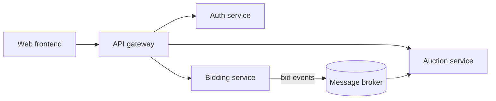

# Distributed Auction Platform
{: .no_toc }

An online auction and bidding platform built as a set of independently deployable services, with a web frontend for browsing lots and placing bids.
{: .fs-5 .fw-300 }

{: .warning }
[TODO: Resolve the stack before publishing. Your CV lists TypeScript / NestJS / AWS, while the project reports describe Java / Spring Boot / Azure. This page, your CV and your interview answers must all describe the same system.]

| | |
|---|---|
| **Type** | [TODO: Coursework / group / personal] |
| **My role** | [TODO: The services or features you owned] |
| **Stack** | [TODO: The confirmed stack] |
| **Period** | [TODO: Month Year – Month Year] |
| **Source** | [TODO: Repository link, or "Private"] |

  
Contents

  {: .text-delta }
- TOC
{:toc}

## Problem

Auctions look like simple CRUD but are concurrency problems underneath: many bidders compete for the same lot at the same moment, the highest valid bid must win deterministically, and an auction must close at an exact time even if services restart.

[TODO: Scope of your version — number of services, users, and the features you shipped.]

## Architecture

[TODO: Replace with your real service diagram.]

## Key decisions

These are the questions interviewers usually probe on an auction system. Answer each with what you actually did.

### Concurrent bids on the same lot

[TODO: How you guaranteed that two simultaneous bids cannot both "win": row locking, optimistic concurrency with a version column, a single writer per auction, or something else.]

### Closing auctions on time

[TODO: How auction end times are enforced, and what happens if a service is down at closing time.]

### Service boundaries and communication

[TODO: Why the services are split where they are; synchronous calls versus events.]

## Results

[TODO: What worked, with numbers if you load-tested it.]

## What I'd change

[TODO: Honest lessons, for example whether microservices were justified at this scale.]
