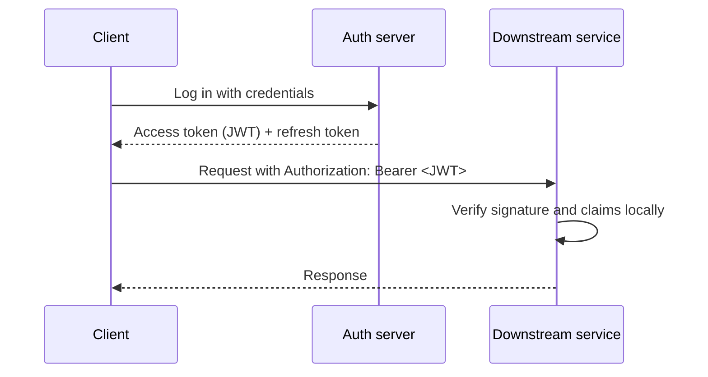

# Custom Authentication Server in Go
{: .no_toc }

An authentication server written from scratch in Go that issues JSON Web Tokens (JWTs) for a future multi-service architecture. It is a deliberate learning project: the goal was to understand every step of token-based authentication rather than hide it behind a library or a managed identity provider.
{: .fs-5 .fw-300 }

| | |
|---|---|
| **Type** | Personal learning project |
| **Stack** | Go, [TODO: storage, libraries] |
| **Period** | [TODO: Month Year – Month Year] |
| **Source** | [TODO: Repository link] |

  
Contents

  {: .text-delta }
- TOC
{:toc}

## Problem

Every service in a multi-service system needs to know who is calling it, without each service keeping its own user database or calling a central server on every request. Signed tokens solve this: one server authenticates the user once and issues a token that the other services can verify on their own.

## Architecture

[TODO: Adjust to match your implementation.]

## Key decisions

### Signing algorithm

[TODO: HS256 (shared secret) or an asymmetric algorithm such as RS256 or EdDSA. With asymmetric keys, downstream services only hold the public key and cannot forge tokens, which matters in a multi-service system. Say which you chose and why.]

### Token lifetime and refresh

[TODO: Access token lifetime, how refresh tokens work, and how a token is revoked before it expires.]

### Password storage

[TODO: Hashing algorithm and parameters (for example Argon2id or bcrypt), and why.]

### Key rotation

[TODO: How signing keys are rotated without invalidating every live token, for example with a `kid` header and a published key set.]

## Results

[TODO: What works today, how you tested it, and any benchmark numbers.]

## What I'd change

[TODO: What building it yourself taught you, and when you would use an off-the-shelf provider instead.]
