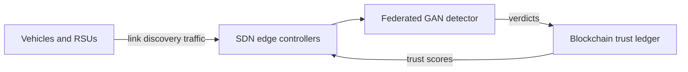
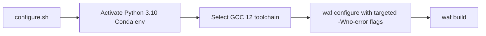

# Defending SDVENs Against Link Discovery Attacks
{: .no_toc }

A security framework that detects and mitigates link discovery attacks in Software-Defined Vehicular Edge Networks (SDVENs), combining a federated GAN-based detector with a blockchain trust layer. Evaluated through large-scale ns-3 simulation campaigns run on a university HPC node.
{: .fs-5 .fw-300 }

| | |
|---|---|
| **Type** | Final-year research project (group) |
| **My role** | [TODO: The components you personally owned] |
| **Stack** | ns-3.35 (C++), Python, [TODO: ML framework, blockchain platform] |
| **Period** | [TODO: Start month] – August 2026 (report submitted 9 August 2026) |
| **Source** | [TODO: Repository link, or "Private"] |

  
Contents

  {: .text-delta }
- TOC
{:toc}

## Problem

In a software-defined network, the controller builds its view of the topology through link discovery. If an attacker can forge or manipulate link discovery traffic, the controller's topology view is poisoned: traffic can be routed through attacker-controlled nodes, or legitimate links can be hidden. Vehicular edge networks make this harder to defend, because the topology changes constantly as vehicles move, so "a new link appeared" is normal behaviour rather than a red flag.

[TODO: State your exact threat model in one or two sentences: which attack variants you considered and what the attacker controls.]

## Architecture

[TODO: Replace this diagram with your real component diagram.]

[TODO: Two or three sentences per component: what it does and why it is there. Expand the framework's acronym (BSGFT) here on first use.]

## Key decisions

### Federated rather than centralised training

[TODO: Why federated learning fits vehicular edge networks — for example raw data staying at the edge, bandwidth, privacy — and what it cost you in convergence or complexity.]

### Blockchain for trust records

[TODO: What the ledger stores, why a shared tamper-evident record was needed, and how you kept its overhead acceptable.]

### A reproducible simulation toolchain

ns-3.35 predates current compilers, and building it on a modern Ubuntu system (GCC 13, libstdc++ 13) fails in several cascading ways: headers that older libstdc++ versions included transitively (such as `<cstdint>`) are no longer pulled in, newer warnings trip `-Werror`, and the waf build requires Python 3.10 rather than a newer system Python.

Rather than patching the ns-3 sources ad hoc, I made the build reproducible:

- **Pinned compiler:** GCC 12 for the ns-3 build.
- **Targeted warning suppression:** specific `-Wno-error=` flags for the known false positives, instead of disabling `-Werror` globally.
- **Isolated Python:** a Conda environment pinned to Python 3.10.
- **One entry point:** a `configure.sh` wrapper that applies all of the above, so any team member (or the HPC node) gets an identical build from a single command.

## Results

Detection performance is reported with **TIR** and the **Matthews correlation coefficient (MCC)**. MCC uses all four cells of the confusion matrix, so it stays meaningful when malicious links are rare compared with legitimate ones, a case where plain accuracy looks misleadingly high.

[TODO: Define TIR in one sentence.]

[TODO: Headline numbers, the baseline you compared against, and one chart or table. Export charts as PNG/WebP into assets/images/sdven/ and embed them.]

## What I'd change

[TODO: One or two honest lessons, such as simulation scale, the evaluation design, or the toolchain choices.]
