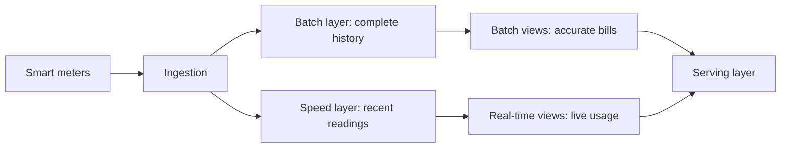

# voltstream — Smart Grid Billing Pipeline
{: .no_toc }

A data engineering pipeline that turns smart meter readings into electricity bills, built on the Lambda architecture: a batch layer for accurate billing over the full history and a speed layer for near-real-time consumption views.
{: .fs-5 .fw-300 }

| | |
|---|---|
| **Type** | Big Data Analytics coursework |
| **My role** | [TODO: What you owned] |
| **Stack** | [TODO: Ingestion, batch, stream, storage and serving technologies] |
| **Period** | [TODO: Month Year – Month Year] |
| **Source** | [TODO: Repository link] |

  
Contents

  {: .text-delta }
- TOC
{:toc}

## Problem

Billing must be exact and reproducible, which favours batch processing over the complete dataset. Customers and grid operators also want to see consumption as it happens, which needs streaming. The Lambda architecture runs both paths side by side and merges their results at query time.

## Architecture

[TODO: Name the technology used in each layer.]

## Key decisions

### Lambda rather than Kappa

[TODO: Why you kept a separate batch path instead of a single streaming pipeline, and what the duplication cost you.]

### Late and out-of-order readings

[TODO: How the speed layer handles meters that report late, and how the batch layer corrects it.]

### Tariff calculation

[TODO: Where tariff logic lives and how you kept it identical in both layers.]

## Results

[TODO: Data volume processed, batch run time, streaming latency.]

## What I'd change

[TODO: Lessons learned.]
